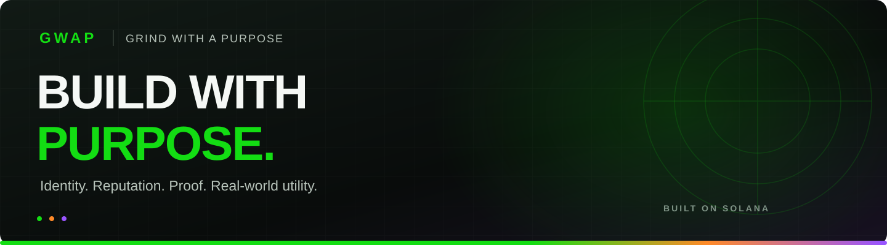

  

<h1 align="center">Tha Emerald General</h1>

  <strong>Founder of GwapSpot · Building useful products on Solana</strong>

  <a href="https://www.gwapspot.com">GwapSpot</a> &nbsp;·&nbsp;
  <a href="https://app.gwapspot.com">GwapSpot OS</a> &nbsp;·&nbsp;
  <a href="https://oarprotocol.xyz">OAR Protocol</a> &nbsp;·&nbsp;
  <a href="https://x.com/_GwapSpot">X</a>

---

### Building a network with purpose

I'm the founder behind **GWAP — Grind With A Purpose**. I'm building GwapSpot into a network where identity, reputation, proof, and practical tools work together.

My focus is making blockchain useful in everyday life: helping people build, establish trust, and participate in a digital economy with more confidence.

**Current focus:** GwapSpot OS, social reputation, verifiable agreements, and application identity on Solana.

**The principle:** Access is free. Identity is cheap. Trust compounds.

 

### Featured work

| Project | What I'm building | Explore |
| :--- | :--- | :--- |
| **GwapSpot OS** | The GWAP application layer, bringing identity, reputation, proof, and workspaces into one experience. | [Source](https://github.com/gwapupward-hub/gwapspot-web) · [App](https://app.gwapspot.com) |
| **GwapScore** | Social-first reputation, with optional verified wallet evidence as a supporting signal. Trust is demonstrated through activity; wealth and wallet balance do not define it. | [Source & model](https://github.com/gwapupward-hub/GwapScore-Official-v1) |
| **Private Proof Vault** | Solana primitives for wallet-authorized proof timestamps, exact-version agreements, and a separately gated escrow kernel. | [Source & deployment gates](https://github.com/gwapupward-hub/ppv) |
| **Open App Registry** | Permanent App IDs connecting Solana applications to verifiable publishers, domains, programs, and source repositories. | [Protocol](https://github.com/gwapupward-hub/oar) · [Website](https://oarprotocol.xyz) |

Deployment status and release readiness are documented in each project's repository.

### The bigger picture

**GNS** brings human-readable `.gwap` identity to the network. **Daily Ideas** helps people move from an idea toward research, validation, and execution. GwapSpot OS connects these experiences with reputation and proof.

The goal is a network where **identity opens the door, trust grows through participation, and useful work creates value.**

### Tools across the projects

  

I care about clear documentation, explainable systems, practical user experience, and evidence behind every release.

### Connect

Interested in Solana infrastructure, reputation, identity, or useful consumer products? Let's connect.

[Website](https://www.gwapspot.com) · [X / Twitter](https://x.com/_GwapSpot) · [Instagram](https://www.instagram.com/_gwapspot/) · [Project architecture](https://github.com/gwapupward-hub/gwapspot-web/blob/main/docs/master/README.md)

---

<strong>Grind With A Purpose.</strong> Build useful things. Earn trust. Keep moving.

